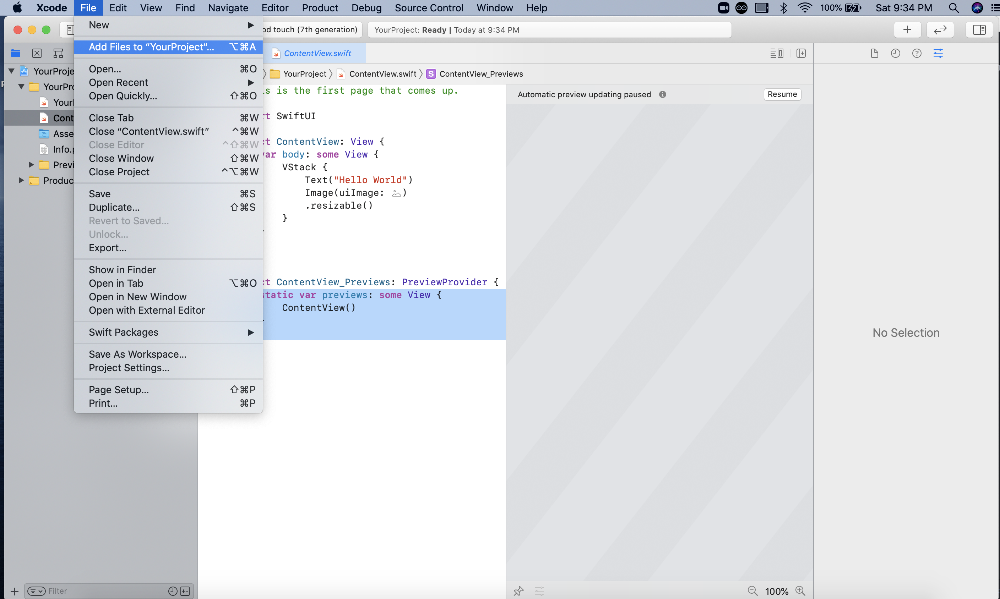
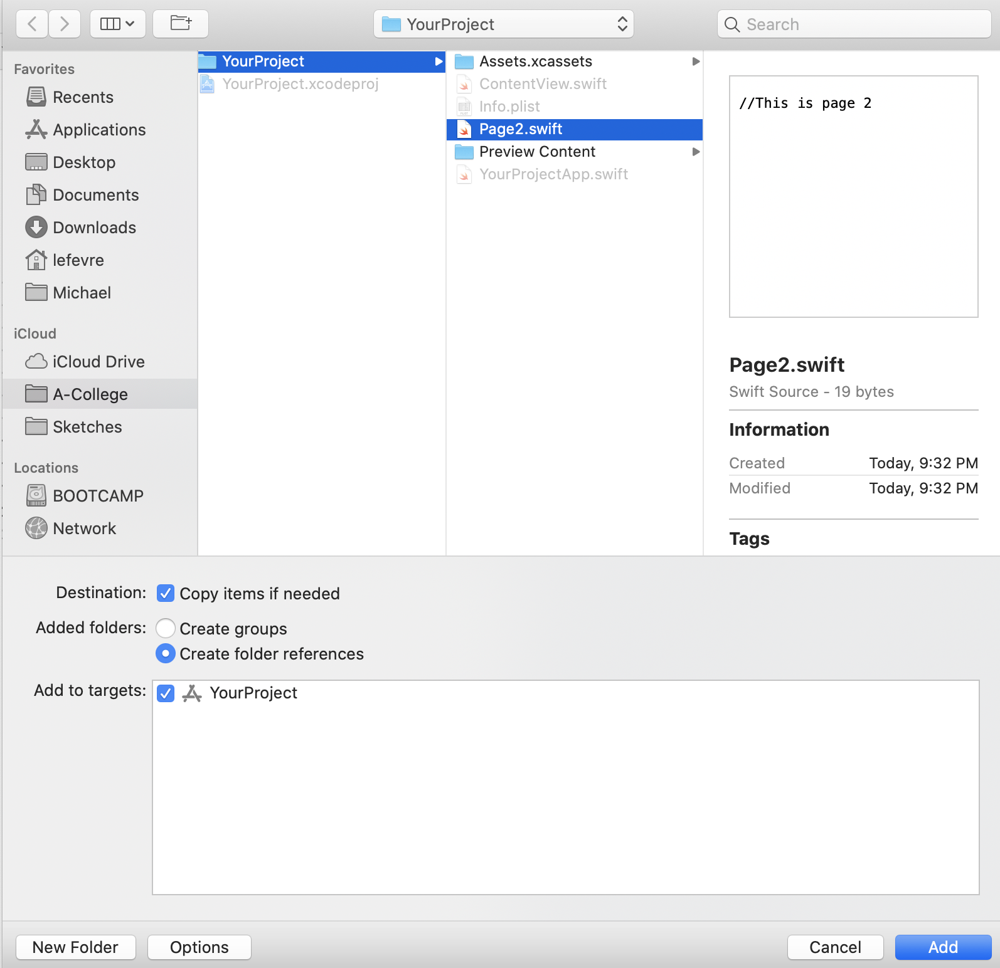

# Swift Playground to App Converter

This script converts a Swift Playground to an iOS App

## Development Environment
This was made using Kotlin version 1.4.10

If you don't have Kotlin installed, go to [this site](https://kotlinlang.org) and install it first.

I compiled all of my code using the command line.

## Usage

This is the first version of the program so it can only convert simple playgrounds right now that only contain Swift files and image files. First, the playground must be an Xcode playground. It can be made in Swift Playgrounds, but it must use an Xcode Playground template for the conversion to work.

Second, change the opening page in the playground to be named ContentView.

Third, take the playground file out of Swift Playgrounds and make sure it is named Playground.playground.

Forth, after downloading all of this projects files, place Playground.playground into the top level folder. Use `kotlinc main.kt -include-runtime -d main.jar` to compile and `java -jar main.jar`.

Fifth, within the XcodeProject folder should be a new folder called YourProject. YourProject will contain the Xcode project created from your playground. The last thing to do will be to open the project and add all of the Swift files to the projects. The images will automatically be included in the project.

Note: In the project there are two folders called YourProject. The YourProject that contains the new Xcode project is the one inside the folder named XcodeProject. I will change one of the folder's name soon that way there will be no confusion.

## Screenshots and More Details

How to add the Swift files to Xcode:

Go to File, then to Add Files, then select the files you want and click add to project.

If conversion is successful, this will be the output:
![Screenshot showing code running.] (coderunning.png)

The first page needs to be renamed `ContentView`
![Screenshot showing code running.] (playground.png)

## Helpful Websites
[Kotlin Main Site](https://kotlinlang.org)
